# Jenkins Docker NGINX Pipeline Project (Amazon Linux 2023)

## 🔥 Overview
This project demonstrates a complete CI/CD pipeline using **Jenkins**, **Docker**, and **NGINX** running on an **Amazon Linux 2023 EC2 instance**.  
The pipeline automatically:
- Clones a GitHub repository
- Builds a Docker image using a Dockerfile
- Runs an NGINX container serving a custom `index.html` file on port **8081**
- Ensures the deployment is consistent and reproducible

This README includes:
- Correct directory structure
- Final Jenkinsfile
- All required screenshots (with proper names)
- Full step‑by‑step setup instructions

---

# 📁 Project Directory Structure (GitHub)

```
jenkins-pipeline-app/
│
├── Dockerfile
├── index.html
├── Jenkinsfile
└── README.md
```

## Architecture Diagram
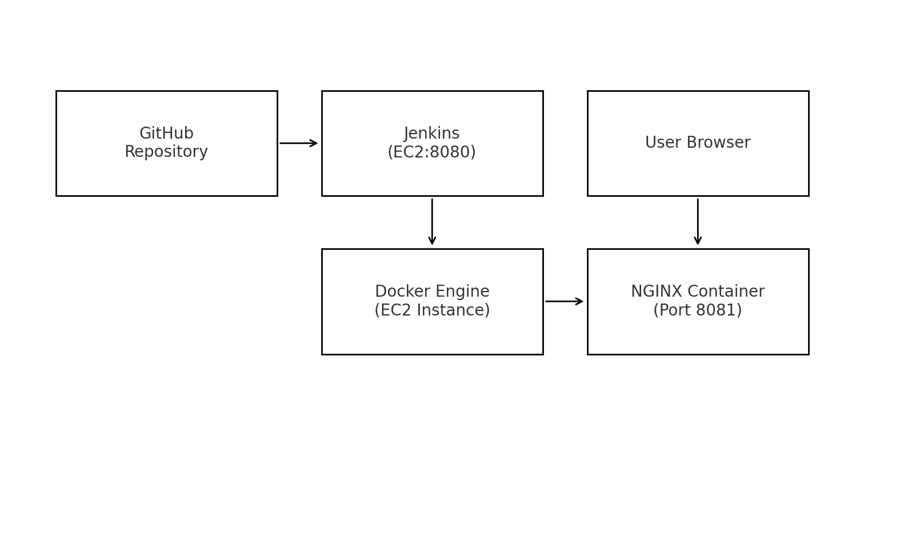

## CI/CD Pipeline Diagram
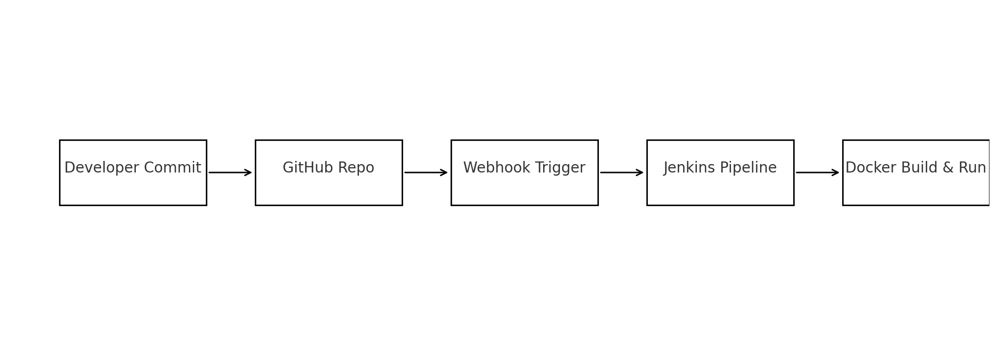

---

# 🚀 Final Jenkinsfile

```groovy
pipeline {
    agent any

    stages {

        stage('Clone Repository') {
            steps {
                git branch: 'main',
                    url: 'https://github.com/YourUserName/jenkins-pipeline-app.git'
            }
        }

        stage('Build Docker Image') {
            steps {
                sh 'docker build -t nginx-pipeline .'
                sh 'docker images | grep nginx-pipeline || true'
            }
        }

        stage('Stop Old Container') {
            steps {
                sh '''
                if [ "$(docker ps -q --filter name=nginx-container | wc -l)" -gt 0 ]; then
                    docker stop nginx-container || true
                    docker rm nginx-container || true
                fi
                '''
            }
        }

        stage('Run Container on Port 8081') {
            steps {
                sh 'docker run -d -p 8081:80 --name nginx-container nginx-pipeline'
            }
        }

        stage('Confirm Running Deployment') {
            steps {
                sh 'docker ps'
            }
        }
    }

    post {
        success {
            echo 'Pipeline executed successfully!'
        }
        failure {
            echo 'Pipeline failed — check console output.'
        }
    }
}
```

---

# 🛠 Setup Instructions (Start → Finish)

## 1️⃣ Launch EC2 (Amazon Linux 2023)
Open ports:
- 22 (SSH)
- 8080 (Jenkins)
- 8081 (NGINX app)


---

## 2️⃣ Install Docker
```bash
sudo dnf update -y
sudo dnf install docker -y
sudo systemctl enable docker
sudo systemctl start docker
sudo usermod -aG docker ec2-user
```

---

## 3️⃣ Create Project Files (on EC2 or GitHub)

### **index.html**
```html
<!DOCTYPE html>
<html>
<head>
    <title>Jenkins Docker Pipeline</title>
</head>
<body>
    <h1>Welcome to my NGINX Deployment using Jenkins Pipeline!</h1>
</body>
</html>
```

### **Dockerfile**
```dockerfile
FROM nginx:latest
WORKDIR /usr/share/nginx/html/
COPY index.html /usr/share/nginx/html/
EXPOSE 80
```

---

## 4️⃣ Manual Docker Test (Recommended Before Jenkins)

```bash
docker build -t nginx-pipeline .
docker run -d -p 8081:80 --name nginx-container nginx-pipeline
docker ps
```

---

## 5️⃣ Create Jenkins Pipeline Job

---

## 6️⃣ Access NGINX Web App

Go to:
```
http://EC2-Public-IP:8081
```


---

# ✅ Conclusion

This project successfully demonstrated the complete lifecycle of a modern CI/CD pipeline using Jenkins, Docker, GitHub Webhooks, and an NGINX deployment running on an Amazon Linux EC2 instance. Through a structured declarative Jenkins Pipeline, source code commits triggered automated builds, artifact archiving, image creation, container management, and deployment in a consistent and repeatable manner.

The implementation showcased essential DevOps principles, including:

Continuous Integration: Automated detection of code changes through GitHub webhooks, immediate pipeline execution, and collection of commit metadata for traceability.

Continuous Delivery/Deployment: Building and deploying the Dockerized application with zero manual intervention after code push.

Infrastructure Automation: Successful container orchestration directly from Jenkins, ensuring the latest code version is always deployed.

Observability & Validation: Archiving artifacts, generating commit logs, and maintaining a recurring automated build history for transparency, debugging, and auditability.

The project also demonstrated resilience through error handling, container cleanup, environment preparation, and reproducible builds. Multiple successful webhook-triggered builds validated the automation pipeline end-to-end.

In summary, this project not only delivered a functional deployment automation pipeline but also reinforced industry-standard DevOps workflows that improve consistency, reliability, and efficiency across software development and deployment cycles. It stands as a solid foundational CI/CD implementation ready to be extended into more advanced workflows such as testing stages, multi-environment deployments, or Kubernetes orchestration.

## Below are screenshots of workflow:

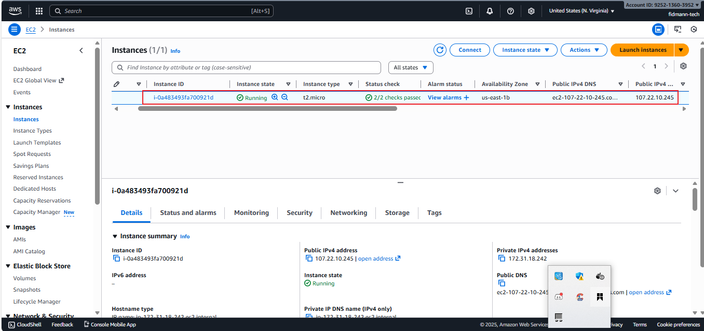
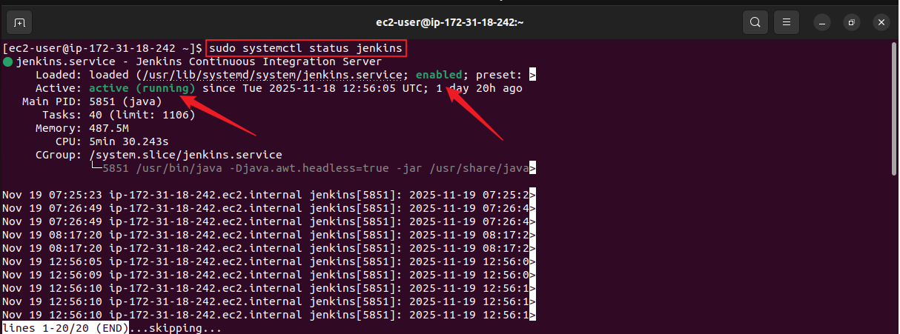
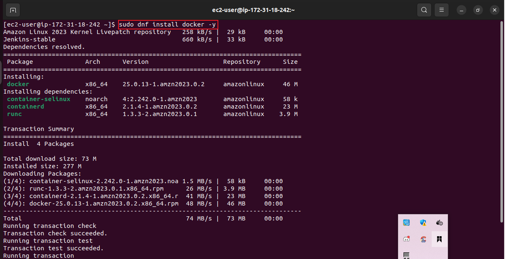
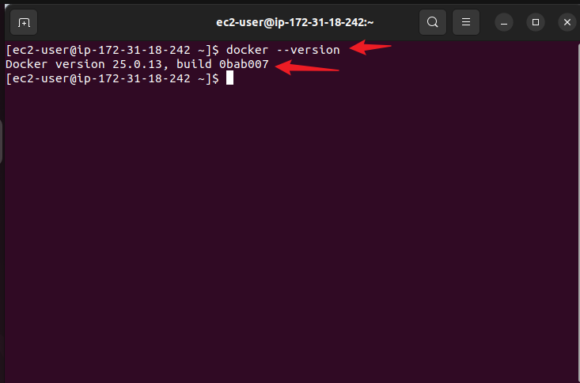


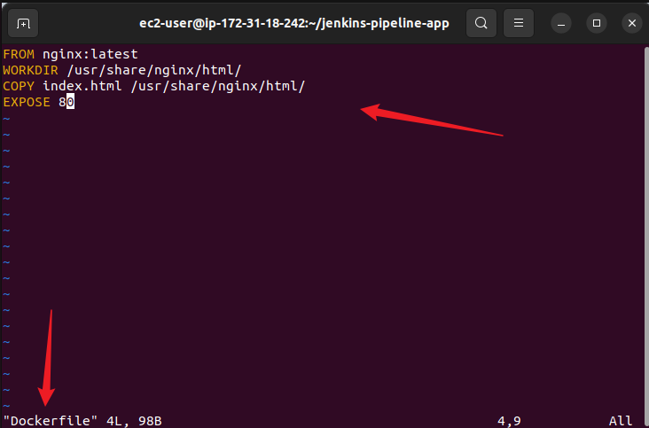
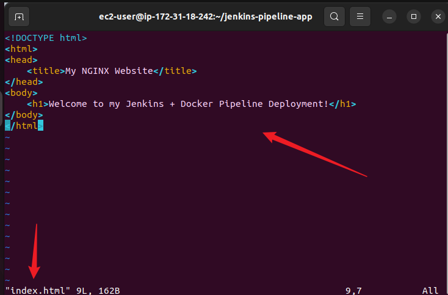

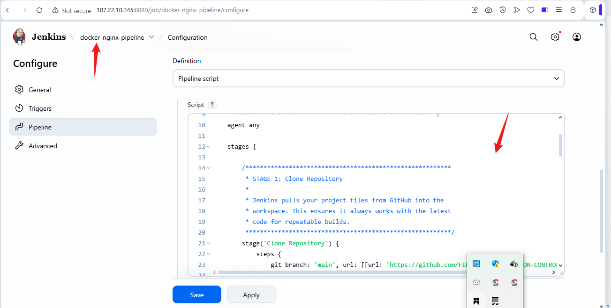
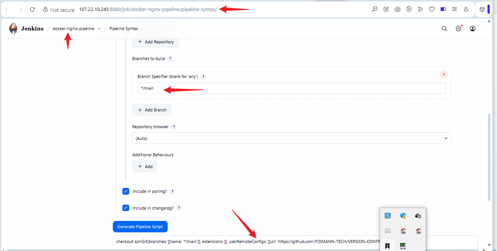

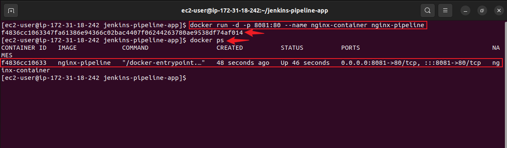


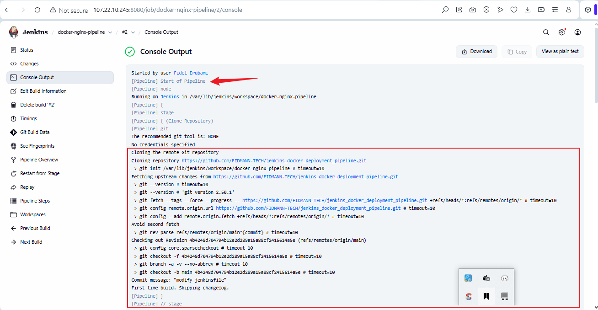
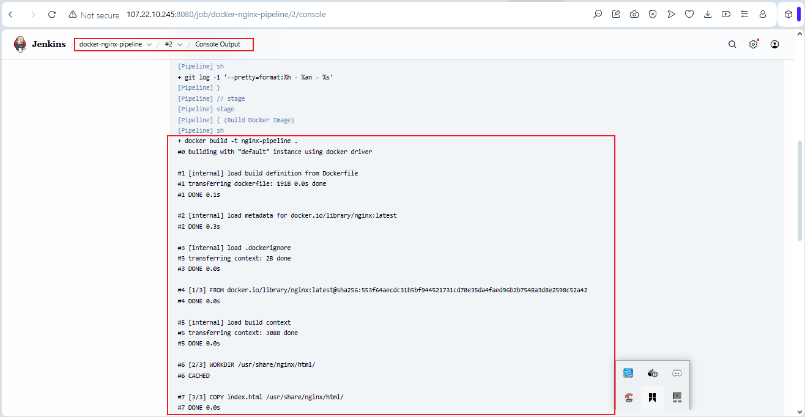
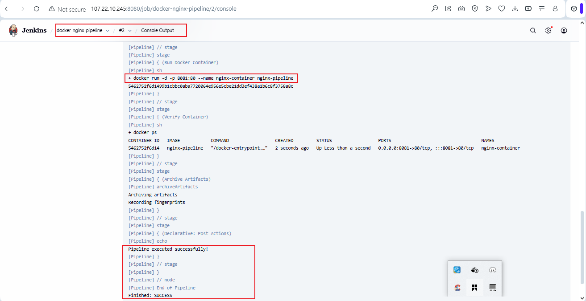
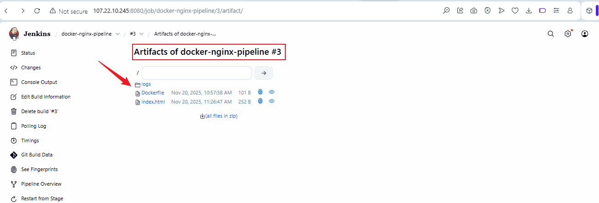
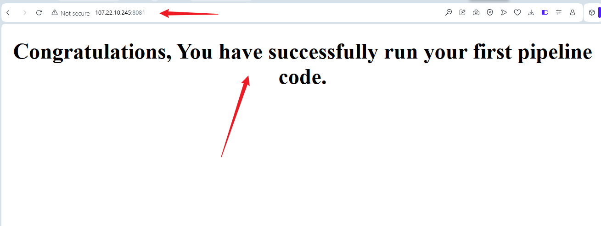
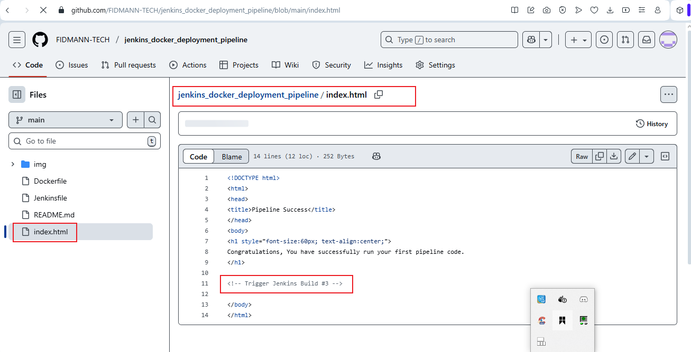
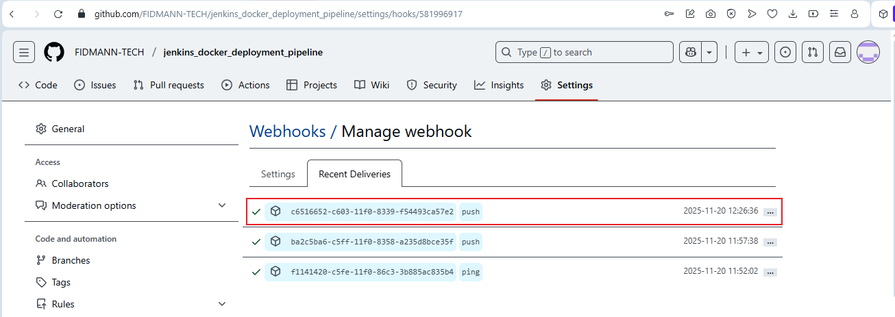
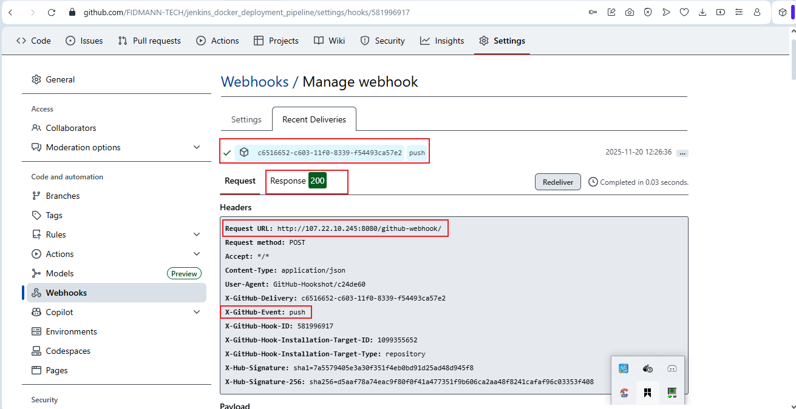